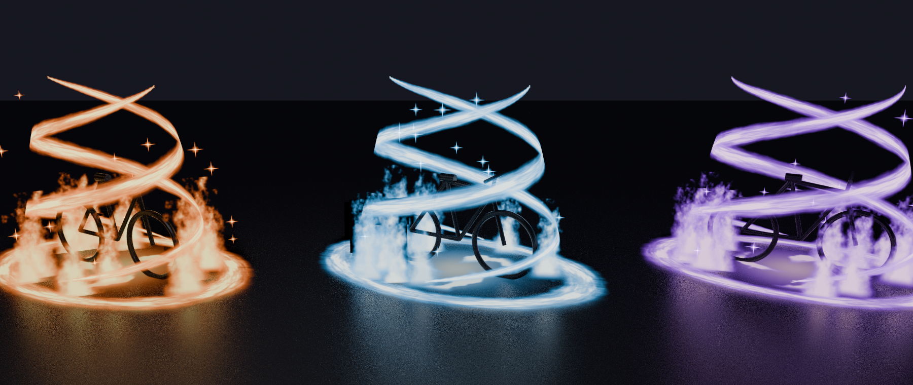

# Auras de vélo (faites dans Blender)

Auras fluides et animées pour **tous** les vélos du jeu : flammes, fumée, tourbillon au sol, étincelles, spirales d'énergie, anneau et traînées. Elles s'emballent quand on accélère.



Tous les réglages sont dans **un seul fichier** (`AuraConfig`). Un changement s'applique à tous les vélos.

## Contenu

| Dossier | Fichier | Rôle |
|---|---|---|
| `Textures/` | `AuraFlame_8x8.png` | Flamme fluide animée (64 images) |
| | `AuraSwirl_8x8.png` | Tourbillon animé (64 images) |
| | `AuraSmoke_8x8.png` | Fumée animée (64 images) |
| | `AuraStreak.png` | Traînée d'énergie (traînées + meshes) |
| | `AuraSpark.png`, `AuraGlow.png` | Étincelle, halo |
| `Meshes/` | `AuraHelix.obj` | Double spirale autour du vélo |
| | `AuraRing.obj` | Anneau au sol |
| `Scripts/` | `AuraConfig.lua` | Réglages + thèmes (ModuleScript) |
| | `AuraServer.server.lua` | Pose l'aura sur les vélos (Script) |
| | `AuraClient.client.lua` | Anime l'aura (LocalScript) |
| `Blender/` | `*.py` | Sources Blender pour tout régénérer |

Les textures sont **blanches** : la couleur vient du thème, donc les mêmes images servent pour tous les thèmes.

## Installation dans Roblox Studio (10 minutes environ)

1. **Images.** Ouvre **Window → Asset Manager → Bulk Import** et importe les 6 PNG du dossier `Textures/`. Ensuite, fais un clic droit sur chaque image → **Copy Asset ID** et colle l'ID au bon endroit dans `AuraConfig` (section `Textures`).
2. **Meshes.** Fais **File → Import 3D**, choisis `AuraHelix.obj`, puis `AuraRing.obj`. Crée un dossier **`AuraAssets`** dans **ReplicatedStorage** et range les deux MeshParts dedans, nommées exactement `AuraHelix` et `AuraRing`. La spirale doit faire environ 5,8 studs de haut. Si elle est minuscule ou énorme, réimporte en changeant l'échelle dans la fenêtre d'import.
3. **Scripts.** Crée ces trois scripts et colle le contenu du fichier correspondant :
   - **ReplicatedStorage** → ModuleScript `AuraConfig` ← `AuraConfig.lua`
   - **ServerScriptService** → Script `AuraServer` ← `AuraServer.server.lua`
   - **StarterPlayer → StarterPlayerScripts** → LocalScript `AuraClient` ← `AuraClient.client.lua`
4. **Vélos.** Ils sont détectés automatiquement si leur nom contient `bike`, `velo` ou `bmx`. Sinon, ajoute le tag **`Bike`** au modèle (Propriétés → Tags).
5. **Thème de chaque vélo.** Sur le modèle du vélo, ajoute un attribut texte **`AuraTheme`** avec le nom d'un thème de `AuraConfig` (par exemple `Feu`). Tu peux aussi remplir `ThemeByBikeName`.

## Ajouter un thème

Dans `AuraConfig.Themes`, ajoute une ligne. `C1` est la couleur du cœur (claire), `C2` celle du bord (saturée) :

```lua
MonTheme = { C1 = Color3.fromRGB(255, 255, 255), C2 = Color3.fromRGB(0, 200, 255) },
```

## Réglages utiles (`AuraConfig`)

- `AuraScale` : taille de l'aura, pour **tous** les vélos.
- `YawOffsetDegrees` : mets `90` si l'aura est de travers par rapport au vélo.
- `OnlyWhenRiding` : l'aura n'apparaît que quand quelqu'un est sur le vélo.
- `FullSpeed`, `TrailMinSpeed`, `BoostSpeed` : quand l'aura s'emballe, quand les traînées apparaissent, quand les étincelles explosent.
- `MaxDistance` : au-delà de cette distance, l'aura est coupée (meilleures performances).

## Régénérer ou modifier les effets dans Blender

```bash
blender -b --python Auras/Blender/textures.py        # toutes les textures
blender -b --python Auras/Blender/meshes.py          # spirale + anneau
blender -b --python Auras/Blender/preview.py         # image d'aperçu
```
