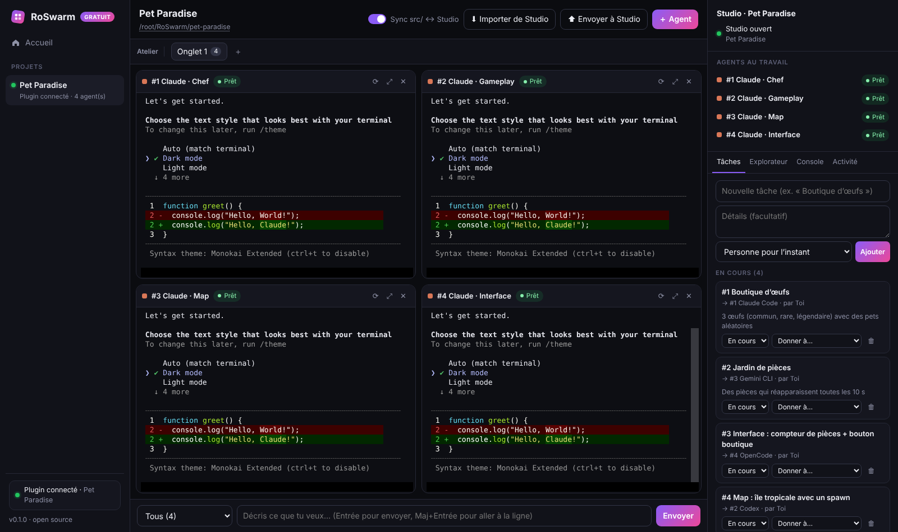
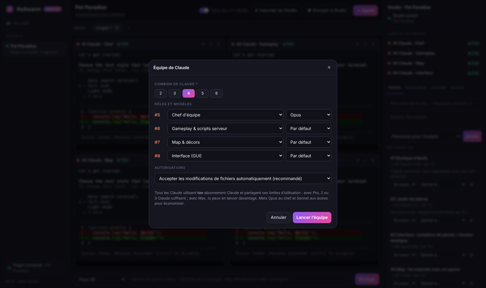

# RoSwarm 🐝 — plusieurs agents IA sur ton jeu Roblox Studio (gratuit)

RoSwarm est une alternative **gratuite et open source** à VibeStarter. C'est une application qui lance
**plusieurs agents IA en même temps** (Claude Code, Codex, Gemini CLI, OpenCode…) sur **le même projet
Roblox Studio**. Chaque agent a son propre terminal. Tous sont branchés sur Studio et se coordonnent entre eux :
réservation des fichiers, tableau de tâches partagé, messages d'équipe.

> Tu utilises tes propres abonnements IA (Claude, ChatGPT, compte Google…). RoSwarm tourne entièrement
> sur ton ordinateur : rien ne passe par un serveur à nous.



## 👥 Une équipe de Claude (même avec un seul abonnement)

Tu n'as que Claude ? C'est le cas prévu en priorité. Clique sur **＋ Agent → Équipe de Claude…**, choisis
2 à 6 Claude et donne un rôle à chacun :

| Rôle | Ce qu'il fait |
|---|---|
| **Chef d'équipe** | Reçoit ta demande, la découpe en tâches et les **assigne** aux autres, puis intègre et vérifie le tout. |
| **Gameplay** | Logique serveur, mécaniques, RemoteEvents. |
| **Map** | Construit le monde dans Studio (terrain, bâtiments, décors, éclairage). |
| **Interface** | ScreenGui, HUD, menus, LocalScripts. |
| **Données** | DataStore, monnaie, inventaire, achats. |
| **Testeur** | Relit, cherche les bugs et les failles, corrige. |

**Comment ça marche :** tu écris ta demande au **Chef** (il est sélectionné automatiquement dans la zone du bas).
Le Chef crée les tâches et les assigne, et RoSwarm **tape automatiquement** chaque tâche dans le terminal du
Claude concerné dès qu'il est libre. Quand un Claude termine sa tâche, le Chef est prévenu de la même façon.
Les Claude se réservent les fichiers : deux Claude ne peuvent pas écrire le même fichier en même temps.



> 🤖 **Mode Autonome (par défaut)** : les Claude modifient les fichiers et utilisent les outils RoSwarm/Studio sans
> demander, et ont pour consigne d'enchaîner leurs tâches sans demander « je continue ? ». Seules les commandes
> système qui ne sont pas en lecture seule demandent encore une confirmation, et les commandes destructrices
> (`rm -rf`, `git reset --hard`, `git push`…) sont interdites.

> 💡 Tous les Claude partagent les limites de **ton** abonnement. Avec Claude Pro, 2 ou 3 Claude suffisent ;
> avec Max, tu peux en lancer plus. Mets **Opus** au Chef et **Par défaut/Sonnet** aux autres pour économiser.
> Le mode « Accepter les modifications automatiquement » évite d'avoir à valider chaque fichier dans chaque terminal.

---

## 🧠 Skills intégrés

Chaque projet reçoit automatiquement 12 **skills** (dans `.claude/skills/`, que Claude Code charge tout seul).
Chaque Claude de l'équipe les a, sans rien installer :

| Skill | Utilité |
|---|---|
| `sobriete-code` | Écrire moins de code : réutiliser Roblox et l'existant avant de créer (inspiré de Ponytail). Moins de tokens, moins de bugs. |
| `reponses-courtes` | Messages brefs entre agents (inspiré de Caveman) : économise ton abonnement. |
| `memoire-projet` | Mémoire partagée dans `MEMOIRE.md` : architecture, décisions, où se trouve quoi. |
| `coordination-equipe` | Comment le Chef découpe et répartit, et comment chacun rend son travail. |
| `roblox-luau` | Luau propre : structure, types, performance, pièges. |
| `roblox-client-serveur` | Client/serveur, RemoteEvents sécurisés, anti-triche. |
| `roblox-donnees` | Sauvegarde fiable des joueurs (DataStore). |
| `roblox-interface` | Interfaces adaptées au mobile et au PC. |
| `roblox-map` | Construire la map proprement dans Studio. |
| `roblox-modeles-3d` | Modèles du Creator Store : choisir, nettoyer les scripts suspects, placer. |
| `roblox-monetisation` | Gamepasses et produits développeur sans bug d'achat. |
| `roblox-debug` | Trouver les erreurs et ne jamais prétendre avoir testé en jeu sans l'avoir fait. |

Pour modifier un skill, édite son fichier et supprime la ligne `<!-- roswarm:auto … -->` : RoSwarm ne l'écrasera plus.

## Ce que ça fait

| | |
|---|---|
| 👥 **Équipe de Claude** | 2 à 6 Claude avec des rôles (Chef, Gameplay, Map, Interface…), un modèle chacun et des notifications automatiques entre eux. |
| 🤖 **Plusieurs agents en parallèle** | Claude Code, Codex, Gemini CLI, OpenCode, un terminal, ou n'importe quel agent en ligne de commande. Chacun dans son vrai terminal, en grille, avec plusieurs onglets. |
| 🔌 **Branché sur Roblox Studio** | Un plugin Studio relie la place ouverte à l'application. Les agents peuvent lire l'arbre du jeu, créer et modifier des parts, des maps, des GUI et des scripts, lancer du code Luau et lire la sortie (Output), y compris pendant un test Play. |
| 🔒 **Pas de conflits entre agents** | Un agent qui modifie un fichier ou une instance la **réserve** pour 10 minutes. Les autres sont refusés et savent qui la tient. Pour Claude Code, c'est automatique, même pour ses éditions de fichiers. |
| 📋 **Tableau de tâches + messages** | Tu crées des tâches et tu les « donnes » à un agent en un clic. Les agents les lisent, les prennent, les terminent et s'écrivent entre eux. |
| 🔁 **Synchronisation des scripts** | Les scripts vivent dans `src/` sous forme de fichiers et sont envoyés automatiquement dans Studio (et inversement). |
| 🧱 **Creator Store** | Les agents peuvent chercher des modèles gratuits et les insérer dans la place. |
| 💬 **Écrire à tous les agents** | Une seule zone de texte pour envoyer une consigne à tous les agents de l'onglet, ou à un seul. |
| 🖥️ **Panneau Studio** | Statut de la connexion, « Agents au travail » (qui fait quoi, quels fichiers réservés), explorateur de la place, console et journal d'activité. |

## Installation (5 minutes)

### 1. Installer Node.js
Télécharge la version **LTS** sur <https://nodejs.org> et installe-la. Ça suffit : pas besoin de Visual Studio ni d'autre outil.

### 2. Télécharger RoSwarm
Sur GitHub : bouton vert **Code → Download ZIP**, puis décompresse le dossier où tu veux.

### 3. Lancer
- **Windows** : double-clique sur **`Lancer RoSwarm (Windows).bat`**
- **Mac** : double-clique sur **`Lancer RoSwarm (Mac).command`**. Si macOS bloque le fichier : clic droit → Ouvrir.

Au premier lancement, les dépendances s'installent (environ une minute). Ensuite, la fenêtre RoSwarm s'ouvre.
Laisse la fenêtre noire ouverte pendant que tu travailles.

> En ligne de commande : `npm install` puis `npm start` (l'interface est sur <http://127.0.0.1:34900>).

### 4. Dans RoSwarm (page **Accueil**)
1. **Plugin Roblox Studio → Installer**, puis (re)démarre Roblox Studio.
2. **Agents IA → Installer** pour ceux que tu veux, puis **Se connecter** pour te connecter à ton compte.
3. **Nouveau projet** : donne un nom à ton jeu.

### 5. Dans Roblox Studio
Ouvre ta place. Studio te demande une fois d'autoriser l'accès à `127.0.0.1` : **accepte**.
La première fois, le plugin doit aussi être **autorisé dans RoSwarm** :
1. la sortie (Output) de Studio affiche un code à 4 chiffres ;
2. RoSwarm affiche en haut à droite « Studio demande l'accès » avec le même code ;
3. si les deux codes sont identiques, clique **Autoriser**.

Ensuite, c'est automatique : tu dois voir « Studio ouvert » en haut à droite.
Tu peux retirer un accès à tout moment depuis Accueil → Configuration → Studios autorisés → **Révoquer**.

> Le bouton **RoSwarm** de l'onglet *Plugins* de Studio active ou coupe la connexion.

## Utilisation

1. Dans ton projet, clique sur **Lancer une équipe de Claude** (ou **＋ Agent** pour ajouter des agents un par un).
2. Écris ce que tu veux dans la zone du bas, à destination du **Chef**, par exemple : *« Fais un simulateur de pets :
   une boutique de 3 œufs, un jardin de pièces qui réapparaissent et un compteur de pièces à l'écran »*.
   Le Chef répartit le travail. Tu peux aussi envoyer un message à **Tous** ou à un seul agent.
3. Tu peux aussi créer des tâches toi-même dans l'onglet **Tâches** et les **donner** à un agent précis :
   elles lui sont envoyées dès qu'il est libre.
4. Teste dans Studio (Play). Les agents voient les erreurs de la sortie avec `get_console`.
5. Publie depuis Studio (**Fichier → Publier sur Roblox**).

### Où vont les fichiers ?
Chaque projet est un dossier, par défaut `~/RoSwarm/nom-du-jeu` :

```
nom-du-jeu/
├── AGENTS.md / CLAUDE.md / GEMINI.md   ← consignes d'équipe lues par les agents
└── src/                                ← scripts synchronisés avec Studio
    ├── ServerScriptService/Main.server.luau             → Script
    ├── StarterPlayer/StarterPlayerScripts/Hud.client.luau → LocalScript
    └── ReplicatedStorage/Config.luau                     → ModuleScript
```

- À chaque connexion de Studio, RoSwarm **compare** les fichiers, Studio et le dernier état commun :
  ce qui a changé dans les fichiers est envoyé, ce qui a changé dans Studio est rapatrié. Si `src/` est vide,
  les scripts de la place sont **importés** : tu peux donc partir d'un jeu existant.
- Une modification faite à la main dans Studio sur un script synchronisé est recopiée dans le fichier.
- **Rien n'est perdu en cas de conflit.** Si un script a changé des deux côtés, le fichier gagne et la version
  Studio est copiée dans `.roswarm/conflicts/`. Un script écrit à la main dans Studio est aussi copié là
  avant d'être remplacé.
- La ligne « Sync » sous le nom du projet affiche les scripts à jour, en attente, en échec, en conflit et les
  erreurs de syntaxe signalées par Studio. Un script n'est « à jour » que lorsque **Studio a confirmé** l'avoir reçu.
- Le **monde** (parts, maps, interfaces, éclairage) n'est pas en fichiers : les agents le construisent
  directement dans Studio. Chaque action d'un agent peut être annulée avec Ctrl+Z dans Studio.

## Outils donnés aux agents (serveur MCP « roswarm »)

| Studio | Équipe |
|---|---|
| `studio_status`, `get_tree`, `get_instance`, `search` | `agents_status` : qui fait quoi |
| `run_luau` : exécuter du Luau dans Studio | `claim` / `release` : réserver des fichiers ou instances |
| `create_instance`, `set_properties`, `delete_instance` | `board_read` : tâches et messages |
| `set_script_source`, `sync_files`, `pull_scripts`, `sync_status` | `task_create` (critères, dépendances), `task_update` |
| `get_console` : sortie de Studio (même en Play) | `post_message` |
| `check_scripts` : syntaxe vérifiée par le compilateur de Studio | `validation_report` : écrit / synchronisé / syntaxe OK / erreurs |
| `asset_search`, `asset_insert` : Creator Store | |

**Validation des tâches** : un agent qui termine une tâche créée par quelqu'un d'autre la fait passer
« À valider ». Le créateur (souvent le Chef) ou toi la validez avec **✓ Valider**. `validation_report`
ne déclare jamais un test en jeu (Play) comme fait : cette étape reste à faire dans Studio.

La configuration MCP est faite **automatiquement** pour chaque agent lancé depuis RoSwarm. Tu n'as rien à régler.

## RoSwarm vs VibeStarter

| | VibeStarter | RoSwarm |
|---|---|---|
| Prix | 147 € | **Gratuit** (MIT) |
| Plusieurs agents en parallèle sur un projet Studio | ✅ | ✅ |
| Claude Code / Codex / Gemini / OpenCode | ✅ (+ Grok, Antigravity) | ✅ (+ n'importe quel CLI via « Commande perso ») |
| Plugin Studio connecté en direct | ✅ | ✅ |
| Coordination (réservations, tâches) | ✅ | ✅ |
| Windows / Mac | ✅ | ✅ (+ Linux pour l'app, sans Studio) |
| Langage du jeu | TypeScript | **Luau** : fonctionne aussi sur tes jeux existants |
| Banque de 67 000 assets | ✅ | Creator Store de Roblox (recherche + insertion) |
| Génération d'images, 3D, musique par IA | ✅ (crédits payants) | ❌ |
| Bouton « Publier » intégré | ✅ | ❌ (publie depuis Studio) |
| Cours vidéo, Discord membres | ✅ | ❌ |

## Problèmes fréquents

- **« En attente de Studio »** : vérifie que le plugin est installé et à jour (Accueil → Plugin), que Studio a été
  redémarré, que tu as accepté l'accès HTTP à `127.0.0.1`, que tu as cliqué **Autoriser** dans RoSwarm,
  et que le bouton RoSwarm du plugin est activé.
- **« Sync : x en échec »** : survole le message pour voir la cause. Une erreur venant de Studio est réessayée dès
  que tu modifies le fichier. Une absence de réponse est réessayée toute seule.
- **Un agent est grisé dans « ＋ Agent »** : il n'est pas installé. Va dans Accueil → Installer.
- **Installation d'un agent refusée sur Mac** (`EACCES`) : ton npm global a besoin des droits admin.
  Lance dans un Terminal `sudo npm install -g <paquet>`, ou installe Node avec nvm.
- **Port 34900 déjà utilisé** : lance avec `ROSWARM_PORT=34901 npm start`, remplace `34900` par `34901`
  en haut de `plugin/RoSwarm.lua`, puis réinstalle le plugin depuis l'accueil.
- **Gemini « Disabled »** : RoSwarm marque automatiquement le dossier du projet comme fiable pour Gemini.
  Relance l'agent Gemini si besoin.

## Sécurité

- Le serveur n'écoute que sur `127.0.0.1`. Il n'existe pas d'option pour l'exposer sur le réseau.
- L'interface, l'API et le serveur MCP exigent le jeton secret de l'application (`~/.roswarm/token`).
- Le plugin Studio doit être **autorisé explicitement** (appairage avec un code). Il reçoit alors son propre jeton,
  dont seule une empreinte est stockée. Ce jeton est révocable, et il n'est valable que pour les routes du plugin.
- Chaque session Studio est générée par le serveur, liée à son jeton et expire après 35 s d'inactivité.
  Un résultat envoyé pour la commande d'une autre session est refusé.
- Toutes les données reçues sont validées (types, tailles, chemins). Les chemins sont confinés au dossier `src/`
  du projet, et les liens symboliques ne sont pas suivis.
- **Limites** : un programme malveillant qui tourne déjà sous ton compte peut lire `~/.roswarm/`, comme le reste
  de tes fichiers. Les agents tournent avec **tes** droits dans le dossier du projet : garde un œil sur ce qu'ils
  font, comme avec n'importe quel agent de code.

Détails techniques (sessions, livraison des commandes, synchronisation, verrous, tâches) : [docs/PROTOCOL.md](docs/PROTOCOL.md).

## Mise à jour depuis la version 0.1

1. Remplace le dossier RoSwarm par la nouvelle version, puis lance-la.
2. Accueil → Plugin Roblox Studio → **Mettre à jour**, puis redémarre Studio.
3. À la première connexion, **autorise** le plugin (voir l'étape 5 de l'installation). L'ancien plugin n'est plus
   accepté, car il ne s'authentifiait pas.

Tes projets, tâches et fichiers sont conservés. La première connexion fait une réconciliation complète.

## Développement

```bash
npm install
npm run dev    # serveur sans ouvrir de fenêtre
npm test       # tous les tests : unitaires, sécurité, synchronisation, coordination, bout en bout
LUAU_BIN=/chemin/vers/luau npm test   # ajoute la vérification du code Luau du plugin avec l'interpréteur Luau
```

Les tests utilisent un **plugin Studio simulé** (`test/helpers.js`) qui suit le protocole de `plugin/RoSwarm.lua`.
Ce qui ne peut être vérifié que dans un vrai Roblox Studio est décrit dans [docs/TESTS-STUDIO.md](docs/TESTS-STUDIO.md).

Organisation du code :

```
server/index.js      serveur HTTP + WebSocket (interface, API, routes du plugin)
server/agents.js     terminaux (node-pty) et configuration MCP/hooks de chaque agent
server/studio.js     pont avec le plugin : sessions, livraison des commandes (long-polling)
server/pluginAuth.js appairage et jetons du plugin
server/tools.js      outils MCP (Studio + équipe)
server/coord.js      réservations, tâches, messages, activité
server/roles.js      rôles de l'équipe (Chef, Gameplay, Map…)
server/sync.js       synchronisation src/ <-> Studio (états, nouvelles tentatives, réconciliation)
server/syncCore.js   logique pure : chemins, empreintes, plan de réconciliation
server/bridge.cjs    serveur MCP (stdio) lancé par chaque agent
server/hook.cjs      hook Claude Code (réservations automatiques et statut)
plugin/RoSwarm.lua   plugin Roblox Studio
public/              interface
```

Licence MIT. RoSwarm n'est affilié ni à Roblox Corporation, ni à Anthropic, OpenAI, Google, ni à VibeStarter.
